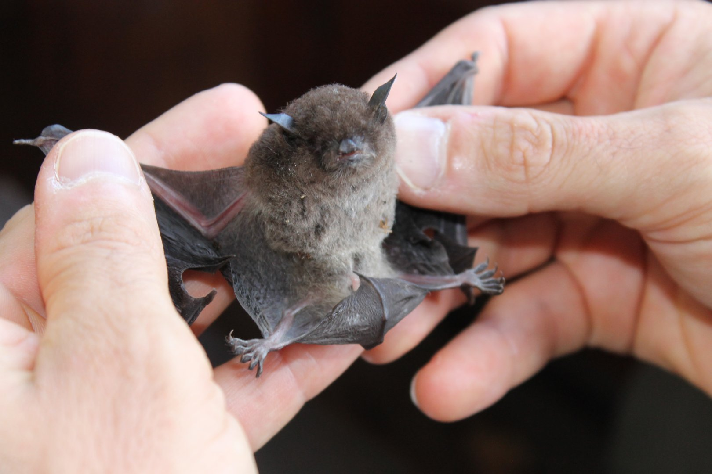

Homework \#3: Binomial regression
================

## Question 1: Probability of independent events

In a population of guppies, 35 are drab-colored and 65 are
brightly-colored.

**1a) (3pts)** You catch 10 guppies in a net, one at a time, throwing
each one back. What is the probability that exactly 7 of them will be
brightly-colored, assuming all guppies are equally likely to be caught
in your net? Calculate the probability in R and annotate each step of
your calculation.

**1b) (3pts)** What is the probability that first seven guppies caught
will be brightly-colored, and the last three will be drab colored? What
is the difference between this calculation and the previous one, based
on the probability principles we discussed in class?


Above: Color variation in Venezuelan guppies (*Poecilia reticulata*)

## Question 2: Responses of insectivorous bats to urbanization?



Above: *Myotis macropus*

The dataset “bats_Caryletal2016.csv” (in this repository) is a subset of
a real dataset, published in *Journal of Applied Ecology*:

*Caryl, Fiona M.; Lumsden, Linda F.; van der Ree, Rodney; Wintle,
Brendan A. (2016), Functional responses of insectivorous bats to
increasing housing density support ‘land-sparing’ rather than
‘land-sharing’ urban growth strategies.*
<https://besjournals.onlinelibrary.wiley.com/doi/epdf/10.1111/1365-2664.12549>

The authors of this study wanted to know how increased urbanization
impacted the occurrence of 12 different Australian bat species, in the
area around Melbourne. They recorded nightly bat calls at 172 sites, and
based on the distinct call patterns associated with different species,
determined whether each species was present. A truncated version of this
dataset is in this repository, showing the occupancy data they collected
for *Myotis macropus* (Large-footed bat) and *Mormopterus ridei* (Ride’s
free-tailed bat), as well as three of their measured covariates:

``` r
bats <- read.csv("bats_Caryletal2016.csv")
head(bats)
```

    ##   X SITE_ID   BIO X_COORD Y_COORD  DWELL TREE myotis mormo
    ## 1 1       1 Coast  329214 5818849  9.324 30.6      0     0
    ## 2 2       2 Coast  328414 5820084 10.377  8.7      0     0
    ## 3 3       3 Coast  330602 5817966  0.979 36.8      0     1
    ## 4 4       4 Coast  330703 5818777  0.299 34.3      1     0
    ## 5 5       5  High  338955 5819634  7.285  9.7      1     0
    ## 6 6       6  High  339345 5818973  7.058  6.4      1     0

**BIO** = the bioregion of the site (a category)  
**TREE** = Percentage tree cover within 500 m of the bat call detector  
**DWELL**= Mean gross dwelling density per hectare within 500 m
calculated from census data, as a measurement of urbanization.  
**myotis**= Occupancy data for *Myotis macropus*, with 1 indicating that
species was detected at that site.  
**mormo**= Occupancy data for *Mormopterus ridei*, with 1 indicating
that species was detected at that site.

**2a) (2 pts)** Fit a binomial glm assessing the relationship between
the probability of *Myotis macropus* occupancy at a site (myotis) and
housing density (DWELL). Interpret the meaning of your parameter
estimates on the probability scale using one of the approaches discussed
in class.

**2b) (2 pts)** Assess model fit, using one of the approaches for
binomial glms discussed in class. What does your fit metric indicate
about how much of the variation in your data the model captures?

**2c) (2 pts)** Plot your glm’s mean prediction line with 95% confidence
intervals, along with the raw data. How would you describe the
relationship between urbanization and occurrence of *Myotis macropus*?
At approximately what level of housing density does urbanization have
the strongest effect on probability of *Myotis* occupancy?

**2d) (3 pts)** Fit a second glm assessing the relationship between the
probability of *Mormopterus ridei* occupancy (mormo) and housing
density, assess model fit, and plot its results. How does overall
probability of occurrence and the impact of urbanization differ between
these two bat species (myotis & mormo)? Compare and contrast the results
of the two models.

## Question 3: Simulating binomial data

During our unit on linear regression, we learned how to simulate
normally distributed data, using the function rnorm(), as shown below:

``` r
# Code for simulating a normally distributed dataset:
n=100 # sample size
water_quality<-runif(n, min=0, max=1) #generate predictor variable w/uniform distrib.

#create slope, intercept, sigma:
slope<-5
intercept<-20
sigma<-0.2

## generate normally-distributed response variable:
fish_weight<-rnorm(n, mean=intercept+slope*water_quality, sd=sigma) 
```

You can simulate binomially distributed data (a series of successes
measured from a set number of trials), using the function rbinom(),
which requires you to input the probability and the \# of trials in your
scenario, as below:

``` r
n <- 500 # number of simulated draws from the binomial that you will be taking
pr <- 0.2 # Set the probability
trials <- 10 # Set the number of trials

y <- rbinom(n, trials, pr)
# y will contain a series successes, created by taking draws from the binomial distribution that you have described with "trials" and "pr."
```

**3a) (1 pts)** Briefly (1 sentence) describe a binary variable that you
might measure in your field or in your own research, and a predictor
variable it might respond to.

**3b) (4 pts)** Simulate a dataset from the binomial distribution, using
the following steps:  
Step 1) Simulate a predictor variable using runif or seq.  
Step 2) Select a value for the intercept and slope and create the
deterministic portion of your model. Describe why you selected the
intercept that you did. (You may want to experiment with several
intercept and slope values) 
Step 3) Put the deterministic portion of
your model onto the “probability scale” using the plogis() function, so that:
y <- rbinom(n, trials, p = plogis(a + b*x))
Step 4) Use rbinom to simulate draws from a binomial distribution, using
the deterministic model. Be sure to apply the logistic function to the
deterministic portion of your model, before using rbinom. Check the structure
of the resulting "y" values.

Which sorts of values does your simulation generate?

**3c) (2 pts)** Plot your simulated response against your simulated
predictor variable.

**3d) (2 pts)** Fit a binomial glm on your simulated data. How do your
parameter estimates compare to the values you used to simulate this
data?

**3e) (1pts)** What role is the logit transformation/logistic function
playing in the steps of your data simulation?
