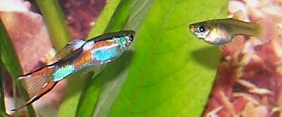

**Homework 3 is due at 11:59pm on February 15th**

```{r setup, include=FALSE}
knitr::opts_chunk$set(echo = TRUE)
```

## Question 1: Probability of independent events

In a population of guppies, 35 are drab-colored and 65 are brightly-colored.

**1a) (2pts)** You catch 10 guppies in a net, one at a time, throwing each one back. What is the probability that exactly 7 of them will be brightly-colored, assuming all guppies are equally likely to be caught in your net? Calculate the probability in R and annotate each step of your calculation.

**1b) (2pts)** What is the probability that first seven guppies caught will be brightly-colored, and the last three will be drab colored? What is the difference between this calculation and the previous one?

```{r, out.width = "400px", echo=FALSE}

```

Above: Color variation in Venezuelan guppies (*Poecilia reticulata*)

## Question 2: Responses of insectivorous bats to urbanization

```{r, out.width = "400px", echo=FALSE}
knitr::include_graphics("myotis.jpg")
```

Above: *Myotis macropus*


The dataset "bats_Caryletal2016.csv" (in this repository) is a subset of a real dataset, published in *Journal of Applied Ecology*:  

*Caryl, Fiona M.; Lumsden, Linda F.; van der Ree, Rodney; Wintle, Brendan A. (2016), Functional responses of insectivorous bats to increasing housing density support 'land-sparing' rather than ‘land-sharing’ urban growth strategies.*
https://besjournals.onlinelibrary.wiley.com/doi/epdf/10.1111/1365-2664.12549

The authors of this study wanted to know how increased urbanization impacted the occurrence of 12 different Australian bat species, in the area around Melbourne. They recorded nightly bat calls at 172 sites, and based on the distinct call patterns associated with different species, determined whether each species was present. A truncated version of this dataset is in this repository, showing the occupancy data they collected for *Myotis macropus* (Large-footed bat) and *Mormopterus ridei* (Ride's free-tailed bat), as well as three of their measured covariates:  

```{r}
bats <- read.csv("bats_Caryletal2016.csv")
head(bats)
```

**SITEID**=	An ID number for each recording site    
**XCOORD / YCOORD**=	Coordinate location for each site  
**BIO** = the bioregion of the site (a category)  
**TREE** = Percentage tree cover within 500 m of the bat call detector  
**DWELL**=	Mean gross dwelling density per hectare within 500 m calculated from census data, as a measurement of urbanization.  
**myotis**= Occupancy data for *Myotis macropus*, with 1 indicating that species was detected at that site.  
**mormo**= Occupancy data for  *Mormopterus ridei*, with 1 indicating that species was detected at that site.  


**2a) (2 pts)** Fit a glm assessing the relationship between the probability of *Myotis macropus* occupancy at a site (myotis) and housing density (DWELL). Plot the predictions of your glm, with 95% CIs, along with the raw data. 

**2c) (2 pts)** Examine the plotted model prediction and the coefficients from your fitted model. How would you describe the relationship between urbanization and occurrence of *Myotis macropus*? 

**2d) (2 pts)** At approximately what level of housing density does urbanization have the strongest effect on probability of *Myotis* occupancy?

**2e) (2 pts)** Using plogis() and coef(), what is the expected probability of *Myotis* occupancy in areas without any houses?

**2f) (4 pts)** Fit a second glm assessing the relationship between the probability of *Mormopterus ridei* occupancy (mormo) and housing density. How does the "baseline" probability of occurrence differ between these two bat species (myotis & mormo)?  How does the impact of urbanization differ between the two species?


## Question 3: Simulating binomial data

During our unit on linear regression, we learned how to simulate normally distributed data, using the function rnorm(), as shown below: 

```{r}
# Code for simulating a normally distributed dataset:
n=100 # sample size
predictor<-runif(n, min=0, max=1) #generate predictor variable w/uniform distrib.

#create slope, intercept, sigma:
slope<-5
intercept<-20
sigma<-0.2

## generate normally-distributed response variable:
response<-rnorm(n, mean=intercept+slope*predictor, sd=sigma) 

plot(response~predictor)

```

You can simulate binomially distributed data (# successes / # trials), using the function rbinom(), which requires the following parameters: probability of success (pr), the # of trials in your design (trials), and the sample size (n).

```{r}
n <- 500 # number of simulated draws from the binomial that you will be taking
pr <- 0.2 # Set the probability
trials <- 10 # Set the number of trials

y <- rbinom(n, trials, pr)
# y will contain the number of successes (a discrete integer value) out of the number of trials assigned above.
```

**3a) (1 pts)** Briefly (1 sentence) describe a binary (0,1) variable that you might measure in your field or in your own research, and a predictor variable it might be correlated with.

**3b) (4 pts)** Simulate the binary response variable you describe above, using the binomial distribution with 1 trial. Use the following steps:  
- Step 1) Simulate a predictor variable using runif() or sample().  
- Step 2) Assign a value for the intercept and slope and create the deterministic portion of your model, for "p". Be sure to apply the logistic function to the deterministic portion of your model, to convert to the probability scale.   
- Step 3) Use rbinom to simulate draws from a binomial distribution, using the deterministic model for the probability of success and trials = 1.

Examine the values for your response variable. Did your dataset contain all 1s? Or all 0s? If so, describe why this was the case. Experiment with values of intercept and slope until you obtain a response that contains a combination of 0s and 1s.

**3c) (1 pts)** Plot your simulated response against your simulated predictor variable. 

**3d) (2 pts)** Fit a binomial glm on your simulated data. Interpret the effect size of your slope by calculating the difference between a maximum and minimum value of your predictor variables using the inverse logit transformation/logistic function. Write a sentence about the biological meaning of the effect size.


